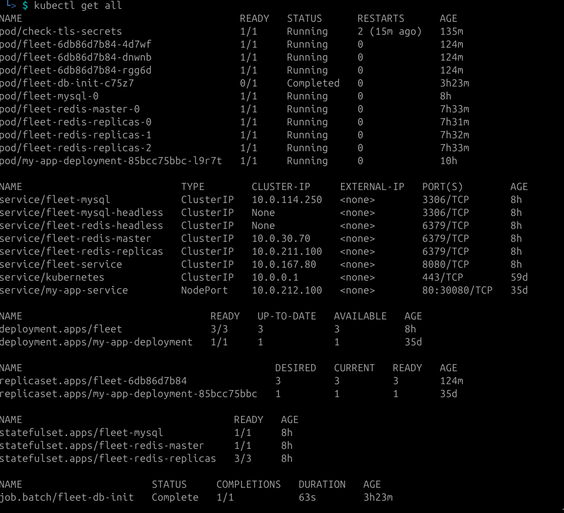

## start helm chart
```
PASSWORD=$(openssl rand -base64 32) echo $PASSWORD

sudo helm repo add fleet https://fleetdm.github.io/fleet/charts
sudo helm repo update
helm install fleet fleet   --repo https://fleetdm.github.io/fleet/charts   --values values.yaml   --set auth.rootPassword="n2P/js1Jucn6aq2+plVwghdyAs0D7x8Zd176eOlmOzo="

export MYSQL_ROOT_PASSWORD=$(kubectl get secret --namespace "default" fleet-mysql -o jsonpath="{.data.mysql-root-password}" | base64 -d)
```

## generate tls
```
kubectl describe secret mysql -n default
  # Generate a private key
openssl genpkey -algorithm RSA -out server.key
   # Generate a self-signed certificate
openssl req -new -x509 -key server.key -out server.cert -days 365
ls
pwd
kubectl create secret tls fleet   --cert=server.cert   --key=server.key   --namespace=default

kubectl get pods -l app=fleet -o=jsonpath='{.items[0].spec.containers[0].image}'
fleetdm/fleet:v4.66.0   

kubectl create secret tls fleet \
  --cert=server.cert \
  --key=server.key \
  --namespace=default

  # Generate a private key
openssl genpkey -algorithm RSA -out server.key

# Generate a self-signed certificate
openssl req -new -x509 -key server.key -out server.cert -days 365
kubectl get secret fleet-tls -n default -o yaml

kubectl create secret tls fleet-tls --cert=/path/to/server.cert --key=/path/to/server.key -n default

# create for mounts
ls -ld /mnt/data/redis
ls -ld /mnt/data/mysql


#check debug services
kubectl run -i --tty --rm debug --image=busybox --restart=Never -- sh
```

## Warning  FailedScheduling  85s   default-scheduler  0/1 nodes are available: pod has unbound immediate PersistentVolumeClaims. preemption: 0/1 nodes are available: 1 Preemption is not helpful for scheduling.

```
kubectl get pvc -n default
kubectl get pv

kubectl get pvc -n default 
NAME                                STATUS   VOLUME                              CAPACITY   ACCESS MODES   STORAGECLASS   VOLUMEATTRIBUTESCLASS   AGE
data-fleet-mysql-0                  Bound    redis-data-pv1                      10Gi       RWO                           <unset>                 9h
redis-data-fleet-redis-master-0     Bound    data-fleet-mysql-0                  10Gi       RWO                           <unset>                 9h
redis-data-fleet-redis-replicas-0   Bound    redis-data-pv                       10Gi       RWO                           <unset>                 9h
redis-data-fleet-redis-replicas-1   Bound    redis-data-fleet-redis-replicas-1   10Gi       RWO                           <unset>                 8h
redis-data-fleet-redis-replicas-2   Bound    redis-data-fleet-redis-replicas-2   10Gi       RWO                           <unset>                 7h49m


```
# kubectl logs fleet-7d4f56887d-2cgqm -n default --previous
 ts=2025-04-22T03:44:23.434582643Z mysql="could not connect to db: dial tcp 127.0.0.1:3306: connect: connection refused, sleeping 0s"
 ts=2025-04-22T03:44:23.435559877Z mysql="could not connect to db: dial tcp 127.0.0.1:3306: connect: connection refused, sleeping 1s"
 ts=2025-04-22T03:44:24.43611866Z mysql="could not connect to db: dial tcp 127.0.0.1:3306: connect: connection refused, sleeping 2s"
 ts=2025-04-22T03:44:26.436929006Z mysql="could not connect to db: dial tcp 127.0.0.1:3306: connect: connection refused, sleeping 3s"


# mysql
```
sudo chown -R root:root /mnt/data/redis
sudo chown -R root:root /mnt/data/mysql
sudo chmod -R 775 /mnt/data/redis
sudo chmod -R 775 /mnt/data/mysql

securityContext:
  fsGroup: 1001  # Set an appropriate group ID
```

apiVersion: v1
kind: PersistentVolume
metadata:
  name: redis-data-pv-new
spec:
  capacity:
    storage: 10Gi
  volumeMode: Filesystem
  accessModes:
    - ReadWriteOnce
  persistentVolumeReclaimPolicy: Retain
  hostPath:
    path: /mnt/data/redis  # Ensure this path exists or adjust based on your setup
```
# mysql="could not connect to db: dial tcp 127.0.0.1:3306: connect: connection refused"

kubectl exec -it fleet-mysql-0 -- env | grep MYSQL_ROOT_PASSWORD
MYSQL_ROOT_PASSWORD=mEWI251Cs5

kubectl exec -it fleet-mysql-0 -- mysql -u root -pmEWI251Cs5


kubectl exec -it fleet-mysql-0 -- env | grep MYSQL_ROOT_PASSWORD
MYSQL_ROOT_PASSWORD=mEWI251Cs5

kubectl exec -it fleet-mysql-0 -- mysql -u root -pmEWI251Cs5

```

```

kubectl exec -it fleet-6cd6f8bdf8-br6wd -- printenv | grep FLEET_MYSQL_ADDRESS
kubectl exec -it fleet-6cd6f8bdf8-2wxvq -- nslookup fleet-mysql.default.svc.cluster.local

kubectl describe secret fleet-tls -n default
echo "bjJQL2pzMUp1Y242YXEyK3BsVndnaGR5QXMwRDd4OFpkMTc2ZU9sbU96bz0=" | base64 --decode

kubectl get secret fleet-tls -n default -o jsonpath='{.data.tls\.crt}' | base64 --decode
kubectl get secret fleet-tls -n default -o jsonpath='{.data.tls\.key}' | base64 --decode


# You can change the authentication plugin for the user that Fleet is using to connect to MySQL by running the following SQL query inside your MySQL instance:

ALTER USER 'your_mysql_user'@'%' IDENTIFIED WITH caching_sha2_password;

# You can create a new user with caching_sha2_password if needed:

CREATE USER 'new_user'@'%' IDENTIFIED WITH caching_sha2_password BY 'your_password';

# If you have already updated the MySQL user to use caching_sha2_password, ensure that the Fleet MySQL user has the correct permissions to connect to the database. You can grant permissions and change authentication plugins via MySQL CLI. For example, to ensure the user has the right permissions and authentication:

GRANT ALL PRIVILEGES ON your_database.* TO 'your_mysql_user'@'%';
FLUSH PRIVILEGES;
ALTER USER 'your_mysql_user'@'%' IDENTIFIED WITH caching_sha2_password BY 'your_password';

# Once logged into MySQL, run:

SELECT user, host, plugin FROM mysql.user;
This will show which authentication plugin is being used for each user. Ensure that the user Fleet is using is set to caching_sha2_password.

# If the user is still using mysql_native_password, you can update it with the following command:

ALTER USER 'your_mysql_user'@'%' IDENTIFIED WITH caching_sha2_password BY 'your_password';
FLUSH PRIVILEGES;


# This will show if there are any restrictions on the root user. For example, it might be restricted to localhost or another specific host.

SELECT user, host, plugin FROM mysql.user WHERE user='root';


# Once logged in, run the following SQL query to list all MySQL users, This will give you a list of all users and the plugins used for authentication (e.g., mysql_native_password or caching_sha2_password).

SELECT user, host, plugin FROM mysql.user;

# After accessing MySQL, reset the root password:
ALTER USER 'root'@'localhost' IDENTIFIED BY 'newpassword';
FLUSH PRIVILEGES;

# If your_user exists but is not able to log in, it's possible that the user’s permissions are restricted. Check the privileges of the user by running:

SHOW GRANTS FOR 'your_user'@'localhost';

# If you identify that your_user needs privileges, you can grant them. For example, to give your_user access to all databases:
GRANT ALL PRIVILEGES ON *.* TO 'your_user'@'localhost' WITH GRANT OPTION;
FLUSH PRIVILEGES;

# If you see that the user is restricted to localhost, try running this to allow the user to connect from any host:

UPDATE mysql.user SET host='%' WHERE user='your_user';
FLUSH PRIVILEGES;


# If you prefer to use the caching_sha2_password plugin (recommended for newer versions of MySQL), you can update the root user to use it. Run the following SQL:

ALTER USER 'root'@'%' IDENTIFIED WITH caching_sha2_password BY 'mEWI251Cs5';
FLUSH PRIVILEGES;

# If you plan to use a different user (like your_user), you can create or update that user with proper privileges.

CREATE USER 'your_user'@'%' IDENTIFIED WITH caching_sha2_password BY 'your_password';
GRANT ALL PRIVILEGES ON *.* TO 'your_user'@'%' WITH GRANT OPTION;
FLUSH PRIVILEGES;

# you continue to encounter issues with specific users being restricted to localhost, you can update the host for that user to % (to allow connections from any host)

UPDATE mysql.user SET host='%' WHERE user='your_user';
FLUSH PRIVILEGES;

# show rules 
SHOW GRANTS FOR 'fleet'@'%';

# if not enough we can add to it 
GRANT ALL PRIVILEGES ON *.* TO 'fleet'@'%';
FLUSH PRIVILEGES;


```

## work with mysql deployment
```
kubectl exec -it fleet-mysql-0 -- mysql -u root -pmEWI251Cs5
mysql: [Warning] Using a password on the command line interface can be insecure.
Welcome to the MySQL monitor.  Commands end with ; or \g.
Your MySQL connection id is 5500
Server version: 8.0.34 Source distribution

Copyright (c) 2000, 2023, Oracle and/or its affiliates.

Oracle is a registered trademark of Oracle Corporation and/or its
affiliates. Other names may be trademarks of their respective
owners.

Type 'help;' or '\h' for help. Type '\c' to clear the current input statement.

mysql> SELECT user, host, authentication_string FROM mysql.user WHERE user = 'fleet';
Empty set (0.01 sec)

mysql> CREATE USER 'fleet'@'%' IDENTIFIED BY 'n2P/js1Jucn6aq2+plVwghdyAs0D7x8Zd176eOlmOzo=';
Query OK, 0 rows affected (0.02 sec)

mysql> GRANT ALL PRIVILEGES ON fleet.* TO 'fleet'@'%';
Query OK, 0 rows affected (0.00 sec)

mysql> FLUSH PRIVILEGES;
Query OK, 0 rows affected (0.01 sec)

mysql> SELECT user, host, authentication_string FROM mysql.user WHERE user = 'fleet';
+-------+------+-------------------------------------------+
| user  | host | authentication_string                     |
+-------+------+-------------------------------------------+
| fleet | %    | *59AD16D6CE0914111449886F494EB4DAC950AD13 |
+-------+------+-------------------------------------------+
1 row in set (0.00 sec)

mysql> CREATE DATABASE fleet;
Query OK, 1 row affected (0.02 sec)

mysql> SHOW DATABASES;
+--------------------+
| Database           |
+--------------------+
| fleet              |
| information_schema |
| my_database        |
| mysql              |
| performance_schema |
| sys                |
+--------------------+
6 rows in set (0.02 sec)

mysql> mysql> SELECT user, host, authentication_string FROM mysql.user WHERE user = 'fleet';
ERROR 1064 (42000): You have an error in your SQL syntax; check the manual that corresponds to your MySQL server version for the right syntax to use near 'mysql> SELECT user, host, authentication_string FROM mysql.user WHERE user = 'fl' at line 1
mysql> +-------+------+-------------------------------------------+
    -> | user  | host | authentication_string                     |
    -> +-------+------+-------------------------------------------+
    -> | fleet | %    | *59AD16D6CE0914111449886F494EB4DAC950AD13 |
    -> +-------+------+-------------------------------------------+
    -> 1 row in set (0.00 sec)
    -> 
    -> mysql> CREATE DATABASE fleet;
ERROR 1064 (42000): You have an error in your SQL syntax; check the manual that corresponds to your MySQL server version for the right syntax to use near '+-------+------+-------------------------------------------+
| user  | host | au' at line 1
mysql> Query OK, 1 row affected (0.02 sec)
    -> 
    -> mysql> SHOW DATABASES;
ERROR 1064 (42000): You have an error in your SQL syntax; check the manual that corresponds to your MySQL server version for the right syntax to use near 'Query OK, 1 row affected (0.02 sec)

mysql> SHOW DATABASES' at line 1
mysql> +--------------------+
    -> | Database           |
    -> ^C
mysql> 
mysql> 
mysql> GRANT ALL PRIVILEGES ON fleet.* TO 'fleet'@'%';
Query OK, 0 rows affected (0.01 sec)

mysql> FLUSH PRIVILEGES;
Query OK, 0 rows affected (0.00 sec)

mysql> mysql> SHOW DATABASES;
ERROR 1064 (42000): You have an error in your SQL syntax; check the manual that corresponds to your MySQL server version for the right syntax to use near 'mysql> SHOW DATABASES' at line 1
mysql> 
mysql> CREATE DATABASE fleet;
ERROR 1007 (HY000): Can't create database 'fleet'; database exists
mysql> GRANT ALL PRIVILEGES ON fleet.* TO 'fleet'@'%';
Query OK, 0 rows affected (0.02 sec)

mysql> FLUSH PRIVILEGES;
Query OK, 0 rows affected (0.00 sec)

mysql> mysql> SHOW DATABASES;
ERROR 1064 (42000): You have an error in your SQL syntax; check the manual that corresponds to your MySQL server version for the right syntax to use near 'mysql> SHOW DATABASES' at line 1
mysql> SHOW DATABASES;
+--------------------+
| Database           |
+--------------------+
| fleet              |
| information_schema |
| my_database        |
| mysql              |
| performance_schema |
| sys                |
+--------------------+
6 rows in set (0.01 sec)

mysql> exit
Bye

```

## gather information about fleet
```
kubectl logs -l app=fleet
################################################################################
# ERROR:
#   Your Fleet database is not initialized. Fleet cannot start up.
#
#   Run `/usr/bin/fleet prepare db` to initialize the database.
################################################################################
################################################################################
# ERROR:
#   Your Fleet database is not initialized. Fleet cannot start up.
#
#   Run `/usr/bin/fleet prepare db` to initialize the database.
################################################################################
ts=2025-04-22T08:53:18.612669249Z mysql="could not connect to db: Error 1049 (42000): Unknown database 'fleet', sleeping 0s"
ts=2025-04-22T08:53:18.614637066Z mysql="could not connect to db: Error 1049 (42000): Unknown database 'fleet', sleeping 1s"
ts=2025-04-22T08:53:19.616948755Z mysql="could not connect to db: Error 1049 (42000): Unknown database 'fleet', sleeping 2s"
ts=2025-04-22T08:53:21.619944217Z mysql="could not connect to db: Error 1049 (42000): Unknown database 'fleet', sleeping 3s"
ts=2025-04-22T08:53:24.623988227Z mysql="could not connect to db: Error 1049 (42000): Unknown database 'fleet', sleeping 4s"
ts=2025-04-22T08:53:28.626418042Z mysql="could not connect to db: Error 1049 (42000): Unknown database 'fleet', sleeping 5s"
ts=2025-04-22T08:53:33.631212726Z mysql="could not connect to db: Error 1049 (42000): Unknown database 'fleet', sleeping 6s"
ts=2025-04-22T08:53:39.63340985Z mysql="could not connect to db: Error 1049 (42000): Unknown database 'fleet', sleeping 7s"
ts=2025-04-22T08:53:46.641078087Z mysql="could not connect to db: Error 1049 (42000): Unknown database 'fleet', sleeping 8s"
################################################################################
# ERROR:
#   Your Fleet database is not initialized. Fleet cannot start up.
#
#   Run `/usr/bin/fleet prepare db` to initialize the database.
################################################################################

# this job for execute ["/bin/sh", "-c", "/usr/bin/fleet prepare db"]
kubectl apply -f job.yaml 

kubectl get secrets -n default 
NAME                                   TYPE                 DATA   AGE
fleet                                  kubernetes.io/tls    2      8h
fleet-mysql                            Opaque               2      7h50m
fleet-redis                            Opaque               1      7h50m
fleet-tls                              kubernetes.io/tls    2      7h54m
my-app-secret                          Opaque               1      35d
mysql                                  Opaque               1      8h


```

## trouble with redis and how to decide 
kubectl logs -l app=fleet
Failed to start: initialize Redis: refresh cluster: redisc: all nodes failed
NOAUTH Authentication required.
Failed to start: initialize Redis: refresh cluster: redisc: all nodes failed
dial tcp 127.0.0.1:6379: connect: connection refused
Failed to start: initialize Redis: refresh cluster: redisc: all nodes failed
NOAUTH Authentication required.
Failed to start: initialize Redis: refresh cluster: redisc: all nodes failed
dial tcp 127.0.0.1:6379: connect: connection refused

```
            - name: REDIS_URL
              value: "fleet-redis-master.default.svc.cluster.local:6379"  # Redis service address
            - name: FLEET_MYSQL_ADDRESS
              value: "fleet-mysql.default.svc.cluster.local:3306"

            - name: FLEET_REDIS_PASSWORD
              valueFrom:
              secretKeyRef:
              name: fleet-redis  # Correct secret name
              key: redis-password  # Correct key for the Redis password


kubectl get secret fleet-redis -n default -o jsonpath='{.data.redis-password}' | base64 --decode
vWHBKw988p


kubectl get secret fleet-redis -n default -o json | jq '.data'
{
  "redis-password": "dldIQkt3OTg4cA=="
}


kubectl set env deployment/fleet FLEET_REDIS_ADDRESS=fleet-redis-master.default.svc.cluster.local:6379
deployment.apps/fleet env updated

kubectl set env deployment/fleet FLEET_REDIS_PASSWORD=$(kubectl get secret fleet-redis -n default -o jsonpath='{.data.redis-password}' | base64 --decode) -n default

kubectl get secret fleet-redis -n default -o jsonpath='{.data.redis-password}' | base64 --decode
kubectl set env deployment/fleet FLEET_REDIS_PASSWORD=$(kubectl get secret fleet-redis -n default -o jsonpath='{.data.redis-password}' | base64 --decode) -n default
kubectl get pods -l app=fleet -n default
kubectl logs -l app=fleet -n default
```

## trouble with mysql
```
env:        
            - name: FLEET_MYSQL_ADDRESS
              value: fleet-mysql.default.svc.cluster.local:3306
            - name: FLEET_REDIS_ADDRESS
              value: fleet-redis-master.default.svc.cluster.local:6379
```
            
## trouble with tls path

```
volumes:
  - emptyDir: {}
    name: tmp
  - name: fleet-tls
    secret:
      defaultMode: 420
      secretName: fleet-tls  # Update the secret name here
  - emptyDir:
      sizeLimit: 20Gi
    name: osquery-logs


volumeMounts:
  - mountPath: /tmp
    name: tmp
  - mountPath: /secrets/tls
    name: fleet-tls
    readOnly: true
  - mountPath: /logs
    name: osquery-logs

```
# check secrets that we can see in mount
```
kubectl exec -it check-tls-secrets -n default -- /bin/sh
/ # ls /secrets/tls
tls.crt  tls.key
/ # 
```


sometimes should check if we have terminated="open /secrets/tls/server.cert: no such file or directory"

```
volumes:
  - emptyDir: {}
    name: tmp
  - name: fleet-tls
    secret:
      defaultMode: 420
      secretName: fleet-tls  # Update the secret name here
  - emptyDir:
      sizeLimit: 20Gi
    name: osquery-logs


volumeMounts:
  - mountPath: /tmp
    name: tmp
  - mountPath: /secrets/tls
    name: fleet-tls
    readOnly: true  # Ensures the secret is mounted as read-only
  - mountPath: /logs
    name: osquery-logs

```
---------------
## should check that exist path to tls

```
- name: FLEET_SERVER_CERT
  value: /secrets/tls/server.cert
- name: FLEET_SERVER_KEY
  value: /secrets/tls/server.key


- name: FLEET_SERVER_CERT
  value: /secrets/tls/tls.crt
- name: FLEET_SERVER_KEY
  value: /secrets/tls/tls.key

```
```
kubectl logs -l app=fleet -n default

kubectl rollout restart deployment/fleet -n default

kubectl delete pod -l release=fleet
```
